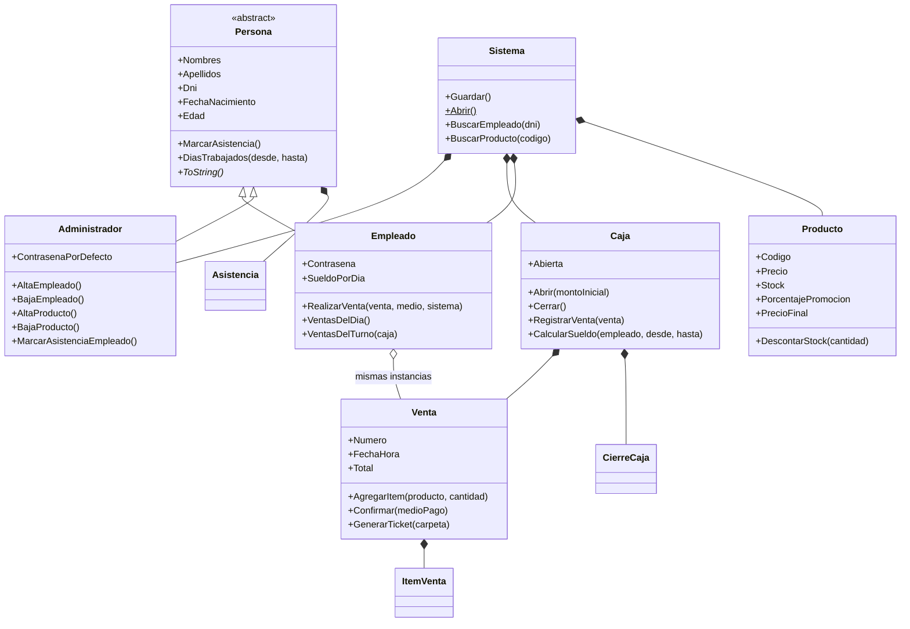
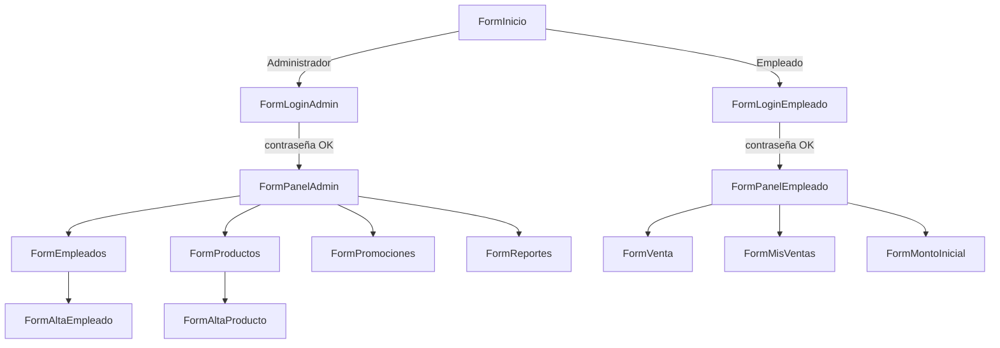
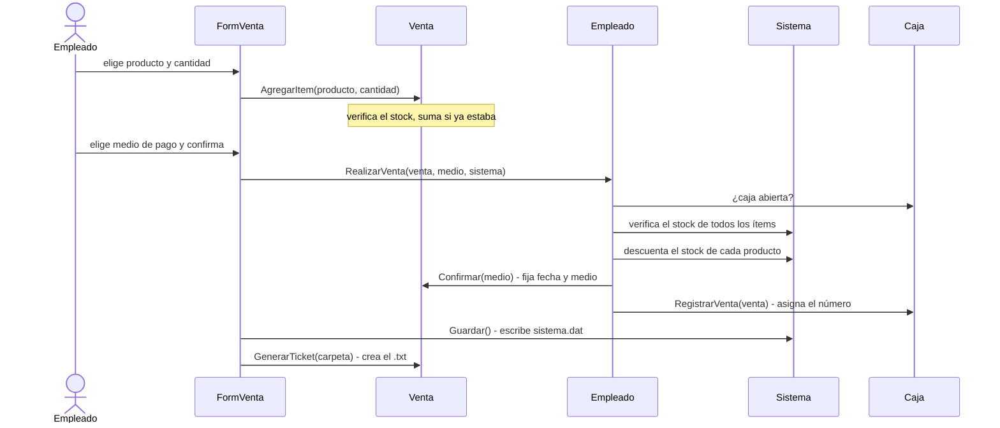

# Manual del programa Kiosco

Guía de uso y explicación de cómo funciona por dentro el sistema de gestión de kiosco
(C# / .NET 8 / Windows Forms).

> Este manual describe las pantallas con texto: no incluye capturas porque el programa
> solo se puede ejecutar en Windows. Todos los nombres de botones, mensajes y valores
> están tomados del código fuente.

## Índice

1. [Qué es y qué hace](#1-qué-es-y-qué-hace)
2. [Instalación y ejecución](#2-instalación-y-ejecución)
3. [Guía de uso](#3-guía-de-uso)
   - [3.1 Pantalla inicial e ingreso](#31-pantalla-inicial-e-ingreso)
   - [3.2 Como administrador](#32-como-administrador)
   - [3.3 Como empleado](#33-como-empleado)
   - [3.4 Recorrido completo de ejemplo](#34-recorrido-completo-de-ejemplo)
4. [Reglas de negocio](#4-reglas-de-negocio)
5. [Validaciones de los campos](#5-validaciones-de-los-campos)
6. [Cómo está hecho por dentro](#6-cómo-está-hecho-por-dentro)
   - [6.1 Estructura de carpetas](#61-estructura-de-carpetas)
   - [6.2 Las clases del modelo](#62-las-clases-del-modelo)
   - [6.3 Navegación entre pantallas](#63-navegación-entre-pantallas)
   - [6.4 Qué pasa al confirmar una venta](#64-qué-pasa-al-confirmar-una-venta)
   - [6.5 Persistencia: cómo se guardan los datos](#65-persistencia-cómo-se-guardan-los-datos)
   - [6.6 Validación con ErrorProvider y Tag](#66-validación-con-errorprovider-y-tag)
   - [6.7 El ticket de venta](#67-el-ticket-de-venta)
7. [Referencia rápida de clases y pantallas](#7-referencia-rápida-de-clases-y-pantallas)
8. [Archivos que genera el programa](#8-archivos-que-genera-el-programa)
9. [Problemas frecuentes](#9-problemas-frecuentes)
10. [Cómo extender el proyecto](#10-cómo-extender-el-proyecto)

---

## 1. Qué es y qué hace

Kiosco es un programa de escritorio para llevar la gestión diaria de un kiosco:

- **Personas**: un administrador y varios empleados, cada uno con su contraseña.
- **Productos**: alta, edición de precio y stock, baja, búsqueda, promociones.
- **Ventas**: el empleado arma un carrito, elige el medio de pago (efectivo o tarjeta) y
  confirma. Se descuenta el stock y se genera un ticket en un archivo de texto.
- **Caja**: se abre con un monto inicial y se cierra al final del turno, con un resumen.
- **Asistencia y sueldos**: se marca la asistencia de cada empleado y se calcula cuánto
  corresponde pagarle.
- **Reportes**: historial de ventas, ventas y sueldos por empleado, y cierres de caja.

**Lo que no hace:** no usa base de datos (todo se guarda en un solo archivo), no funciona en
red (un solo puesto), y solo corre en Windows porque usa Windows Forms.

## 2. Instalación y ejecución

**Requisitos:** Windows 10 u 11 y el SDK de .NET 8 (o Visual Studio 2022 con la carga de trabajo
"Desarrollo de escritorio con .NET").

```
git clone git@github.com:bios666/kiosco-paradigma.git
cd kiosco-paradigma
dotnet run --project Kiosco
```

También se puede abrir `Kiosco.sln` en Visual Studio y ejecutar con **F5**.

> **No pasar el proyecto a .NET 9 o superior.** El programa guarda sus datos con
> `BinaryFormatter`, que fue eliminado en .NET 9 (ver [6.5](#65-persistencia-cómo-se-guardan-los-datos)).

## 3. Guía de uso

### 3.1 Pantalla inicial e ingreso

Al abrir el programa aparece la pantalla **Kiosco** con tres botones:

| Botón | Qué hace |
|---|---|
| **Ingresar como Administrador** | Abre el login del administrador. |
| **Ingresar como Empleado** | Abre el login del empleado. Si todavía no hay empleados, avisa: *"Todavía no hay empleados registrados. Ingrese como Administrador para darlos de alta."* |
| **Salir** | Cierra el programa. |

**Login del administrador.** Se escribe la contraseña y se toca **Ingresar**. La contraseña por
defecto es **`123123`**. Si es incorrecta aparece *"Contraseña incorrecta."*. **Volver** regresa a la
pantalla inicial.

**Login del empleado.** Se elige el empleado en la lista desplegable (ordenados por apellido) y se
escribe su contraseña. Al ingresar correctamente **se marca automáticamente su asistencia del día**
y aparece *"Asistencia registrada: dd/MM/yyyy HH:mm"*. Si ya la había marcado ese día, entra sin
mostrar el aviso y no se duplica.

### 3.2 Como administrador

El **Panel de Administrador** muestra un resumen (cantidad de empleados, de productos y si la caja está
abierta o cerrada) y cinco botones.

#### Empleados

Pantalla con la lista de empleados (apellido y nombre, DNI, edad, sueldo por día y días trabajados
en el mes) y, a la derecha, la **ficha** del empleado seleccionado.

La ficha muestra: DNI, fecha de nacimiento y edad, sueldo por día, días trabajados este mes,
**sueldo a pagar del mes actual**, cuánto vendió este mes, si tiene la asistencia de hoy marcada y sus
últimas 8 asistencias.

| Botón | Qué hace |
|---|---|
| **Nuevo empleado** | Abre el formulario de alta (ver abajo). |
| **Dar de baja** | Pide confirmación y elimina al empleado. Sus ventas anteriores **se conservan** en el historial. |
| **Marcar asistencia de hoy** | El administrador marca la asistencia del empleado seleccionado. Si ya estaba marcada, avisa. |
| **Volver** | Regresa al panel. |

**Alta de empleado.** Campos: nombres, apellidos, DNI, fecha de nacimiento (tres combos: día, mes y año),
contraseña y sueldo por día. Las reglas están en la [sección 5](#5-validaciones-de-los-campos).

#### Productos

Lista con código, nombre, categoría, precio, porcentaje de promoción, precio final, stock y proveedor.
Hay un cuadro **Buscar** que filtra mientras se escribe (por nombre, código o categoría). Las filas de
productos con **5 unidades o menos** se muestran en **rojo**.

| Botón | Qué hace |
|---|---|
| **Nuevo producto** | Alta: código, nombre, categoría, precio, stock y proveedor (opcional). |
| **Editar / stock** | Abre el mismo formulario con los datos cargados. Se puede cambiar todo **menos el código**. Sirve para actualizar precio y stock. |
| **Dar de baja** | Pide confirmación y elimina el producto. Las ventas ya hechas conservan sus datos. |
| **Volver** | Regresa al panel. |

La categoría es un combo **editable**: ofrece Golosinas, Bebidas, Snacks, Cigarrillos, Lácteos,
Panificados, Limpieza y Otros (más las que ya usen tus productos), pero se puede escribir una nueva.

#### Precios y promociones

Lista de productos y dos herramientas:

- **Promoción del producto seleccionado:** un descuento de **0 a 90 %**. Con **Aplicar promoción** el
  producto pasa a cobrarse a su *precio final* (precio de lista menos el descuento). Los productos con
  promoción se resaltan en amarillo. **Quitar todas las promociones** las elimina de todos los productos.
- **Ajuste de precios por categoría:** elige una categoría y un porcentaje de **−50 a +200 %**. **Aplicar
  ajuste a la categoría** modifica el *precio de lista* de todos los productos de esa categoría, previa
  confirmación que indica cuántos se ven afectados.

#### Reportes y cierre de caja

Arriba hay un rango de fechas (**Desde** / **Hasta**, por defecto el mes en curso) y el botón **Filtrar**.
Tres pestañas:

1. **Historial de ventas:** todas las ventas del rango (número, fecha y hora, empleado, cantidad de
   ítems, total y medio de pago), la más reciente primero. Abajo se ve el total dividido entre efectivo
   y tarjeta. **Ver ticket** (o doble clic sobre una venta) muestra el ticket completo.
2. **Ventas y sueldos por empleado:** por cada empleado, cantidad de ventas, total vendido, días
   trabajados y **sueldo a pagar**, más el total de sueldos del período. Los empleados dados de baja que
   tengan ventas aparecen con "(baja)" y sin sueldo.
3. **Cierre de caja:** estado de la caja actual (monto inicial, ventas del turno, efectivo, tarjeta y
   efectivo esperado), el botón **Cerrar caja ahora** (solo habilitado si la caja está abierta) y el
   historial de cierres anteriores.

### 3.3 Como empleado

El **Panel de Empleado** saluda con el nombre, indica si la caja está abierta o cerrada y ofrece:

| Botón | Qué hace |
|---|---|
| **Abrir caja** / **Cerrar caja** | Cambia según el estado. Al abrir pide el **monto inicial** (puede ser 0). Al cerrar pide confirmación y muestra el resumen del turno. |
| **Nueva venta** | Abre la pantalla de venta. Con la caja cerrada avisa: *"La caja está cerrada. Debe abrirla antes de vender."* |
| **Mis ventas** | Historial de las ventas del empleado. |
| **Cerrar sesión** | Vuelve a la pantalla inicial. |

#### Pantalla de venta

A la izquierda, los productos con stock; a la derecha, el carrito.

1. **Buscar** un producto por nombre, código o categoría. Solo aparecen los que tienen stock; los que
   están en promoción se resaltan en amarillo y se muestran con su precio final.
2. Seleccionar el producto, indicar la **cantidad** (1 a 999) y tocar **Agregar al carrito** (o hacer
   doble clic sobre el producto). Si se agrega dos veces el mismo producto, se suman las cantidades.
   Si se pide más de lo que hay, avisa el stock disponible y no agrega nada.
3. **Quitar ítem** saca del carrito el renglón seleccionado. El **Total** se actualiza solo.
4. Elegir el **medio de pago** (Efectivo o Tarjeta). Es obligatorio.
5. **Confirmar venta:** muestra el total y pide confirmación. Al aceptar se descuenta el stock, se
   registra la venta con su número y se genera el ticket. Un mensaje informa el número de venta y la
   ruta del archivo. La pantalla queda lista para el próximo cliente.

Si se sale con productos en el carrito sin confirmar, el programa lo advierte antes de descartarlos.

#### Mis ventas

Lista las ventas del empleado, con dos filtros: **Del día de hoy** o **Del turno (caja actual)**. Muestra
la cantidad y el total, y permite **Ver ticket** de cada una.

### 3.4 Recorrido completo de ejemplo

1. Ingresar como **Administrador** (`123123`).
2. **Empleados › Nuevo empleado:** cargar, por ejemplo, Juan Pérez, DNI 30111222, contraseña `clave1`,
   sueldo por día 20000. Cerrar sesión.
3. Volver a ingresar como Administrador y en **Productos › Nuevo producto** cargar "Coca Cola 500ml"
   (Bebidas, $1500, stock 10) y "Alfajor" (Golosinas, $800, stock 3).
4. En **Precios y promociones**, seleccionar el alfajor y aplicarle 10 % (queda a $720).
5. Cerrar sesión. Ingresar como **Empleado** (Juan Pérez, `clave1`): se marca su asistencia.
6. **Abrir caja** con $5000 de monto inicial.
7. **Nueva venta:** agregar 3 gaseosas y 2 alfajores, elegir Efectivo y confirmar. El total es
   3 × $1500 + 2 × $720 = **$5940**.
8. **Cerrar caja:** el resumen muestra efectivo $5940 y efectivo esperado en caja $10940.
9. Como Administrador, en **Reportes** se ve la venta, el sueldo del día ($20000) y el cierre.

## 4. Reglas de negocio

| Tema | Regla |
|---|---|
| **Una sola caja** | Hay una caja para todo el kiosco. Cualquier empleado puede abrirla o cerrarla, y el administrador puede cerrarla desde Reportes. |
| **Vender exige caja abierta** | Sin caja abierta no se puede confirmar una venta. |
| **Stock** | Cada venta descuenta el stock. No se puede vender más de lo que hay, ni sumando varias veces el mismo producto al carrito. |
| **Precio de venta** | Se cobra el *precio final* (precio de lista con la promoción). Ese precio queda guardado en el ticket: si después cambia el precio o la promoción, las ventas anteriores no cambian. |
| **Numeración** | Las ventas se numeran 1, 2, 3… sin saltos y sin reutilizar números. |
| **Historial inmutable** | Cada venta guarda una copia del nombre y del DNI del empleado y de los datos del producto. Dar de baja a un empleado o a un producto no altera las ventas ya hechas. |
| **Efectivo esperado** | = monto inicial + ventas en efectivo del turno. Las ventas con tarjeta no suman. |
| **Turno** | Son las ventas hechas desde que se abrió la caja. |
| **Asistencia** | Una por día y por persona. Se marca al iniciar sesión el empleado, o desde el panel del administrador. |
| **Sueldo a pagar** | = días trabajados en el período × sueldo por día del empleado. |
| **Baja de empleado** | Se pierden sus asistencias (no se pueden calcular sueldos de un empleado dado de baja); sus ventas se conservan. |
| **DNI y código únicos** | No puede haber dos empleados con el mismo DNI ni dos productos con el mismo código. |

## 5. Validaciones de los campos

Los campos se validan al tocar el botón de guardar o ingresar. Los errores aparecen con un
**ícono rojo** junto al campo (pasando el mouse se ve el mensaje).

**Tipos de validación comunes** (el tipo de cada campo se indica en su propiedad `Tag`):

| Tag | Regla | Mensaje |
|---|---|---|
| `Números` | Obligatorio; solo dígitos. | *Campo obligatorio.* / *Solo se permiten números enteros.* |
| `Letras` | Obligatorio; letras, espacios, apóstrofe y guion. | *Campo obligatorio.* / *Solo se permiten letras.* |
| `Contraseña` | Obligatoria; al menos **4** caracteres. | *Campo obligatorio.* / *Debe tener al menos 4 caracteres.* |
| `Decimal` | Obligatorio; número no negativo. | *Campo obligatorio.* / *Ingrese un importe válido (número positivo).* |
| `Texto` | Obligatorio (no vacío). | *Campo obligatorio.* |
| `Selección` | Hay que elegir una opción del combo. | *Seleccione una opción.* |

**Reglas propias de cada formulario:**

| Formulario | Campo | Regla |
|---|---|---|
| Alta de empleado | Nombres y apellidos | Tag `Letras`. |
| | DNI | Tag `Números`, **7 u 8 dígitos**, mayor a cero, único. |
| | Fecha de nacimiento | Tres combos; la fecha tiene que existir (no vale 31/02). El año arranca **16 años atrás** (edad mínima) y llega hasta 80 años atrás. |
| | Contraseña | Tag `Contraseña` (4 caracteres o más). |
| | Sueldo por día | Tag `Decimal` y además **mayor a cero**. |
| Alta / edición de producto | Código | Tag `Números`, hasta 20 dígitos, único. No se puede cambiar al editar. |
| | Nombre | Tag `Texto`, hasta 40 caracteres. |
| | Categoría | Tag `Texto`, hasta 30 caracteres. |
| | Precio | Tag `Decimal` y **mayor a cero**. |
| | Stock | Tag `Números`, hasta 6 dígitos (0 es válido). |
| | Proveedor | Opcional, hasta 40 caracteres. |
| Monto inicial de caja | Monto | Tag `Decimal` (0 es válido). |
| Reportes | Rango de fechas | "Desde" no puede ser posterior a "Hasta". |

Además, todas las acciones destructivas o importantes (baja, ajuste de precios, cierre de caja,
confirmar venta) piden confirmación con un cuadro **Sí / No**.

## 6. Cómo está hecho por dentro

### 6.1 Estructura de carpetas

```
Kiosco.sln
Kiosco/
├── Kiosco.csproj            Proyecto .NET 8 WinForms (habilita BinaryFormatter)
├── Program.cs               Punto de entrada: abre el sistema y muestra FormInicio
├── Modelo/                  Clases del negocio (sin nada de interfaz)
├── Formularios/             Una pantalla por Form: .cs (lógica), .Designer.cs (diseño), .resx
├── Utilidades/              Validador y Estilo
├── Properties/AssemblyInfo.cs
└── Resources/logo.png       Imagen decorativa (se copia junto al ejecutable)
```

La carpeta `Modelo` **no usa Windows Forms**: toda la lógica de negocio (vender, descontar stock, cerrar
la caja, calcular sueldos) vive ahí, y los formularios solo la llaman y muestran el resultado.

### 6.2 Las clases del modelo



**Herencia y polimorfismo.** `Persona` es abstracta y declara `ToString()` como abstracto: cada hija lo
resuelve a su manera (`Empleado` devuelve "Empleado: Apellido, Nombres (DNI …)" y `Administrador`
"Administrador del sistema"). Los combos de empleados muestran directamente ese texto.

**Encapsulamiento.** Las listas (`asistencias`, `ventas`, `items`, `cierres`) son privadas y se exponen
como `IReadOnlyList`: solo se pueden modificar con los métodos de la clase (por ejemplo
`AgregarItem`, `MarcarAsistencia`), que aplican las reglas.

**Datos copiados, no referenciados.** `Venta` guarda el nombre y el DNI del empleado como texto, e
`ItemVenta` guarda código, nombre y precio del producto. Por eso el historial no cambia cuando cambian o
se borran empleados y productos.

**`Sistema` es la raíz.** Contiene al administrador, la caja, la lista de empleados y la lista de productos.
Todo el estado del programa cuelga de este único objeto, y por eso se puede guardar de una sola vez.

### 6.3 Navegación entre pantallas

No hay capas ni contenedores de inyección: cada pantalla es un `Form` que recibe por constructor lo que
necesita (el `Sistema` y, si corresponde, el `Empleado`).



El patrón se repite en toda la aplicación: la pantalla que abre otra se **oculta** con `Hide()`, abre la
siguiente con `ShowDialog()` (que bloquea hasta que se cierra) y, al volver, se muestra de nuevo con
`Show()`. Los formularios de login devuelven `DialogResult.OK` si el ingreso fue correcto; el de empleado
además expone el empleado ingresado en la propiedad `EmpleadoIngresado`.

### 6.4 Qué pasa al confirmar una venta



Punto clave: `RealizarVenta` **verifica todo antes de modificar nada** (caja abierta, carrito no vacío, stock de
todos los productos). Recién después descuenta el stock. Así una venta no queda a medias si algo falla.
Si el ticket no se puede escribir (por ejemplo, disco lleno), la venta igual queda registrada y guardada y
solo se avisa del problema con el archivo.

### 6.5 Persistencia: cómo se guardan los datos

No hay base de datos. Todo el objeto `Sistema` (con todo lo que contiene) se guarda con **serialización
binaria** en un único archivo: `Documentos\ArchivosKiosco\sistema.dat`.

- **`Sistema.Guardar()`** se llama después de cada operación relevante: altas, bajas y ediciones,
  marcado de asistencia, promociones, apertura y cierre de caja, y cada venta.
- **`Sistema.Abrir()`** se llama una vez al iniciar (`Program.cs`). Si el archivo no existe (primera
  ejecución) devuelve un sistema vacío; no es un error.
- **Escritura segura.** `Guardar()` escribe primero un archivo temporal (`sistema.dat.tmp`) y recién cuando
  terminó lo mueve sobre el archivo real. Así, si el programa se corta a mitad de la escritura, el archivo
  anterior queda intacto.
- **Referencias compartidas.** `Empleado.Ventas` y `Caja.Ventas` apuntan a las *mismas* ventas, no a
  copias. El serializador binario conserva esas referencias, y por eso al reabrir siguen siendo el mismo
  objeto.
- **Archivo dañado.** Si `sistema.dat` existe pero no se puede leer, el programa muestra *"No se pudo abrir
  el archivo del sistema"* y **se cierra sin tocarlo**, para no pisar datos que quizás se puedan recuperar.
- **Todas las clases del modelo llevan `[Serializable]`.** Sin eso no se podrían guardar.

**Por qué .NET 8.** `BinaryFormatter` está obsoleto (advertencia SYSLIB0011) y en .NET 9 dejó de funcionar. El
`.csproj` lo habilita explícitamente con `EnableUnsafeBinaryFormatterSerialization` y silencia esa
advertencia. Es una decisión consciente para respetar el formato "sin base de datos, con serialización
binaria" del enunciado.

**Importante:** el formato binario depende de la estructura exacta de las clases. Si se agrega, quita o
renombra un campo del modelo, un `sistema.dat` viejo puede dejar de abrirse (ver
[Problemas frecuentes](#9-problemas-frecuentes)).

### 6.6 Validación con ErrorProvider y Tag

La clase `Validador` (en `Utilidades`) centraliza las validaciones, así los formularios no repiten código:

1. En el diseñador, cada control que se quiere validar recibe en su propiedad **`Tag`** el nombre del tipo
   de validación (`"Números"`, `"Letras"`, `"Contraseña"`, `"Decimal"`, `"Texto"` o `"Selección"`).
2. Al tocar el botón, el formulario llama a `Validador.ValidarControles(this, errorProvider)`.
3. El validador **recorre todos los controles** del formulario (incluidos los que están dentro de
   contenedores), toma el `Tag` de cada uno y aplica la regla.
4. Por cada error, el `ErrorProvider` dibuja el ícono rojo con el mensaje junto al campo.
5. Devuelve `true` solo si **todos** los campos son válidos.

Los controles sin `Tag` (como el proveedor, que es opcional) no se validan. Las reglas que dependen de más
de un campo o de los datos (fecha inexistente, DNI duplicado, precio mayor a cero) las controla cada
formulario después de la validación común.

### 6.7 El ticket de venta

Al confirmar una venta se crea un archivo de texto en `Documentos\TicketsKiosco\`, con el nombre
`Ticket_<número>_<fecha>_<hora>.txt` (por ejemplo `Ticket_000001_20260918_182843.txt`). Ejemplo real:

```
============================================
          KIOSCO - TICKET DE VENTA
============================================
Nº de venta : 000001
Fecha       : 18/09/2026 18:28:43
Empleado    : Pérez, Juan
Medio pago  : Efectivo
--------------------------------------------
Cant Producto               P.Unit  Subtotal
--------------------------------------------
3    Coca Cola 500ml       1500,00   4500,00
2    Alfajor                720,00   1440,00
--------------------------------------------
                             TOTAL: $5940,00
============================================
           Gracias por su compra!
```

Los nombres de producto de más de 19 caracteres se cortan. El separador decimal (coma o punto) depende de
la configuración regional de Windows.

## 7. Referencia rápida de clases y pantallas

**Modelo** (`Kiosco/Modelo`)

| Clase | Para qué sirve |
|---|---|
| `Persona` | Base abstracta: datos personales, edad calculada y asistencias. |
| `Empleado` | Contraseña, sueldo por día y ventas. Realiza las ventas (`RealizarVenta`). |
| `Administrador` | Da de alta y baja empleados y productos; contraseña por defecto `123123`. |
| `Producto` | Código, nombre, categoría, precio, stock, proveedor y promoción. |
| `Venta` | Carrito y venta confirmada; arma el ticket. |
| `ItemVenta` | Un renglón de la venta (copia de los datos del producto). |
| `Caja` | Apertura y cierre, historial de ventas, totales y sueldos. |
| `CierreCaja` | Resumen de un turno ya cerrado. |
| `Asistencia` | Una fecha y hora de asistencia. |
| `MedioPago` | Enumeración: `Efectivo` o `Tarjeta`. |
| `Sistema` | Raíz de todos los datos; `Guardar()` y `Abrir()`. |
| `Rutas` | Carpetas y archivos que usa el sistema (dentro de Mis Documentos). |

**Utilidades** (`Kiosco/Utilidades`)

| Clase | Para qué sirve |
|---|---|
| `Validador` | Validación de campos por `Tag` con `ErrorProvider`. |
| `Estilo` | Colores comunes de formularios, botones y grillas, y carga del logo. |

**Pantallas** (`Kiosco/Formularios`)

| Formulario | Para qué sirve |
|---|---|
| `FormInicio` | Pantalla inicial: elegir Administrador o Empleado. |
| `FormLoginAdmin` | Login del administrador. |
| `FormLoginEmpleado` | Login del empleado; marca la asistencia. |
| `FormPanelAdmin` | Menú del administrador. |
| `FormEmpleados` | Lista de empleados, ficha, baja y asistencia. |
| `FormAltaEmpleado` | Alta de empleado. |
| `FormProductos` | Lista de productos, búsqueda y baja. |
| `FormAltaProducto` | Alta y edición de producto. |
| `FormPromociones` | Promociones y ajuste de precios por categoría. |
| `FormReportes` | Historial de ventas, ventas y sueldos por empleado, cierre de caja. |
| `FormPanelEmpleado` | Menú del empleado; abrir y cerrar la caja. |
| `FormMontoInicial` | Diálogo del monto inicial al abrir la caja. |
| `FormVenta` | Pantalla de venta con carrito. |
| `FormMisVentas` | Historial de ventas del empleado. |

## 8. Archivos que genera el programa

| Ruta | Contenido |
|---|---|
| `Documentos\ArchivosKiosco\sistema.dat` | Todo el estado del sistema. Se crea al primer guardado. |
| `Documentos\TicketsKiosco\Ticket_*.txt` | Un ticket por cada venta confirmada. |

**Empezar de cero:** cerrar el programa y borrar ambas carpetas. La próxima vez arranca como una primera
ejecución (sin empleados, sin productos y con la caja cerrada). Conviene hacerlo después de probar.

> No abrir dos copias del programa a la vez: cada una guarda su propia versión del estado y la última en
> guardar pisa a la otra.

## 9. Problemas frecuentes

| Síntoma | Causa y solución |
|---|---|
| Al iniciar aparece *"No se pudo abrir el archivo del sistema"* y se cierra | `sistema.dat` está dañado, o se guardó con una versión anterior del programa cuya estructura de clases era distinta. Se puede probar con una copia del archivo de una versión compatible, o borrar la carpeta `ArchivosKiosco` para empezar de cero (se pierden los datos). |
| Error de `BinaryFormatter` / "no se admite" al guardar | Se compiló con .NET 9 o superior. Volver a `net8.0-windows` en `Kiosco.csproj`. |
| *"Todavía no hay empleados registrados"* al ingresar como empleado | Ningún empleado cargado. Ingresar como administrador y darlos de alta. |
| *"La caja está cerrada. Debe abrirla antes de vender."* | Falta abrir la caja: desde el panel del empleado, **Abrir caja**. |
| No aparece un producto en la pantalla de venta | Tiene stock 0 (solo se muestran productos con stock) o no coincide con la búsqueda. Editarlo en **Productos** para reponer el stock. |
| *"Ya existe un empleado registrado con ese DNI."* / *"Ya existe un producto con ese código."* | DNI y código son únicos. |
| Un importe queda con un valor 10 veces o 1000 veces mayor | Los decimales se escriben con el separador de la configuración regional de Windows: en español, la **coma** (`1500,50`). Ahí el punto se interpreta como separador de miles y **no da error**: `12.5` se lee como `125` y `1500.50` como `150050`. Con la configuración regional en inglés pasa al revés. |
| El sueldo de un empleado da 0 | Las asistencias se cuentan por día trabajado: si no marcó asistencia en el período (ni ingresó ni el administrador la marcó), tiene 0 días. |
| La ventana se ve cortada o los controles superpuestos | Puede pasar con escalas de pantalla altas (125 % o más). Probar con una escala menor; el diseño no se pudo verificar en todas las configuraciones. |
| Al compilar en Linux o macOS salen errores | Windows Forms solo funciona en Windows. En otros sistemas solo se puede compilar con `-p:EnableWindowsTargeting=true`, sin ejecutar. |

## 10. Cómo extender el proyecto

**Agregar un dato a los productos (por ejemplo, "fecha de vencimiento").**

1. En `Modelo/Producto.cs`, agregar la propiedad (con su comentario `///`).
2. En `Formularios/FormAltaProducto.Designer.cs` (o con el Diseñador de Visual Studio), agregar el control
   y, si corresponde, su `Tag` de validación.
3. En `FormAltaProducto.cs`, leer el control al guardar y cargarlo al editar.
4. En `FormProductos.cs`, agregar la columna en `ConfigurarColumnas()` y el valor en `CargarGrilla()`.
5. **Borrar el `sistema.dat` viejo** (o migrarlo): al cambiar la estructura de la clase, el archivo
   anterior deja de ser compatible.

**Agregar una pantalla nueva.**

1. Crear el formulario con el Diseñador (`.cs`, `.Designer.cs` y `.resx`) en `Formularios/`.
2. Recibir el `Sistema` (y lo que haga falta) por constructor.
3. Llamar a `Estilo.Aplicar(this)` después de `InitializeComponent()` para heredar el aspecto común.
4. Abrirla desde otra pantalla con el patrón `Hide()` / `ShowDialog()` / `Show()`.
5. Después de cualquier cambio en los datos, llamar a `sistema.Guardar()`.

**Agregar un tipo de validación.** En `Validador.ObtenerError`, agregar un `case` con el nombre del tipo y
poner ese nombre en el `Tag` de los controles.

**Reglas generales del proyecto:** nombres y comentarios en español, comentario `///` en cada clase y método,
la lógica de negocio en `Modelo/` (sin depender de Windows Forms) y las clases del modelo marcadas
`[Serializable]`.
